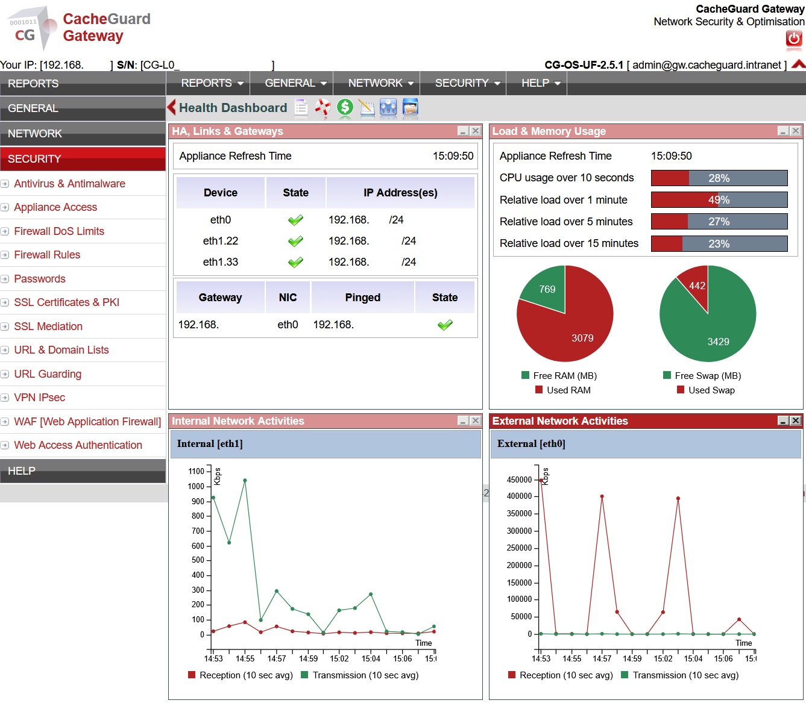
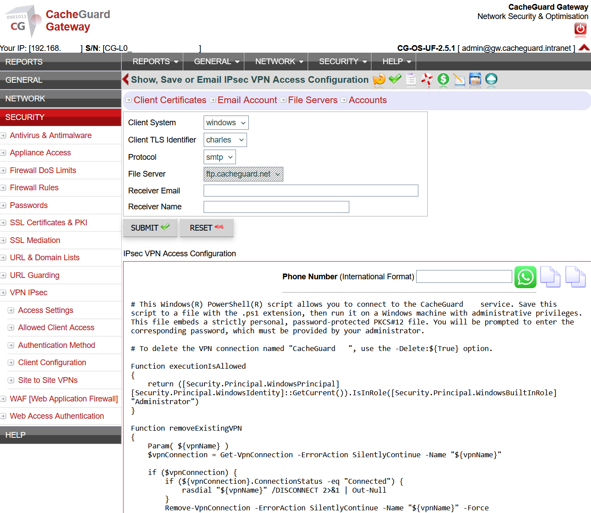
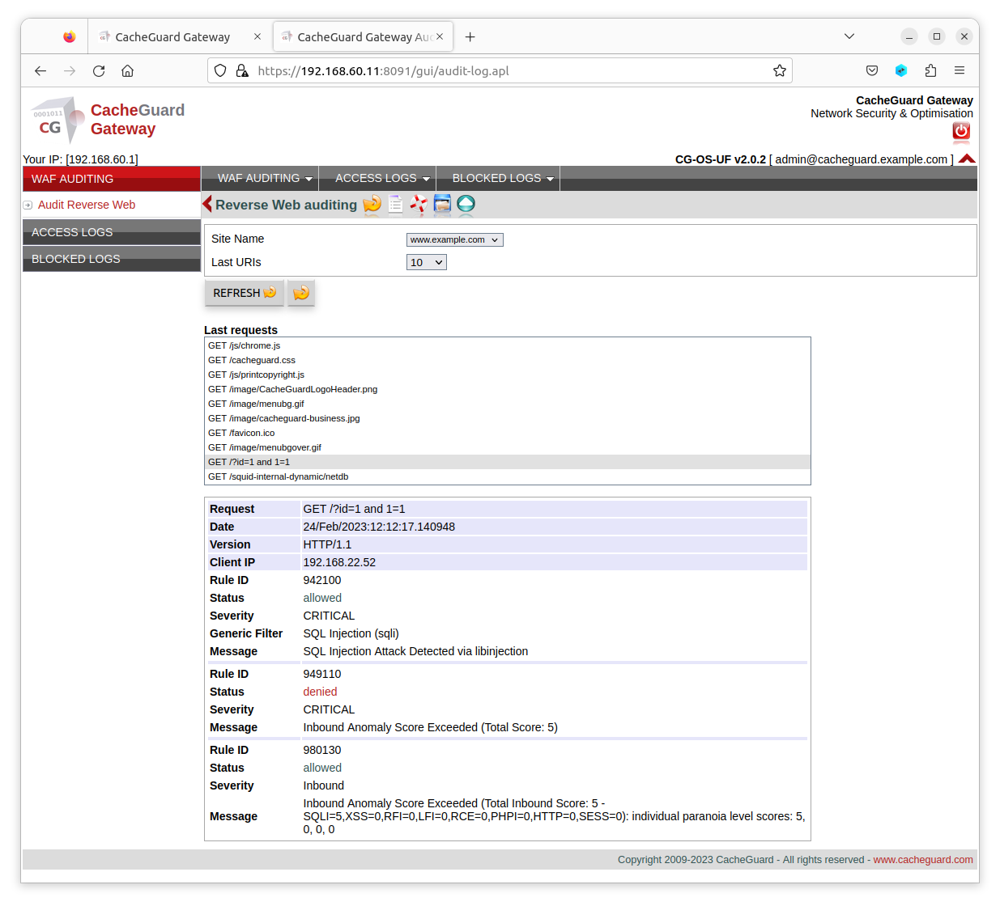

# CacheGuard-OS

**The free open-source network security appliance for startups and growing businesses.**

> Firewall · IPsec VPN · WAF · Antivirus · URL Filtering · SSL Inspection · QoS · Reverse Proxy · Load Balancer — in a single ISO you install in under an hour.

---

## What Is CacheGuard?

CacheGuard-OS is not an application you install on top of an existing operating system. It IS the operating system — a fully custom, network appliance oriented Linux distribution built entirely from scratch since 2002, representing over 5,000 man days of research and development, now completely open source.

Install it on any x86/x64 bare-metal machine or virtual machine and you get a complete, production-ready network security gateway in under an hour. No plugins, no compatibility issues, no surprises. Everything is designed to work together from day one because it was built that way from the ground up.

---

## What Is Included

CacheGuard-OS turns any x86/x64 machine or VM into a full network security appliance:

- **Firewall** — stateful packet filtering with fine-grained traffic control rules
- **IPsec VPN** — secure remote access and site-to-site connectivity for your remote team
- **Web antivirus** — real-time gateway-level malware scanning powered by ClamAV
- **URL filtering** — block malicious or unwanted categories and specific domains
- **SSL inspection** — inspect encrypted HTTPS traffic to detect hidden threats
- **WAF** — protect your web applications with ModSecurity and OWASP Core Rule Set
- **Reverse proxy** — sit in front of your web applications and filter incoming traffic
- **Load balancer** — distribute traffic across multiple backends
- **Multi-WAN QoS** — traffic shaping, bandwidth prioritization and WAN failover
- **Web caching** — reduce bandwidth usage and speed up browsing
- **CacheGuard Manager** — centralized management of multiple appliances from a single dashboard

All features run simultaneously on the same machine. No plugins, no add-ons, no surprises.

---

## Quick Start

### Requirements
- Any x86/x64 machine or hypervisor (VMware, VirtualBox, Proxmox, KVM, Hyper-V, Azure, AWS)
- At least **2 network interfaces**
- 4 CPU cores · 8 GB RAM · 250 GB disk (for up to 100 users)

### Install in 3 steps

1. Download the latest ISO from the [Releases page](https://github.com/cacheguard/CacheGuard-OS/releases/latest)
2. Boot your machine from the ISO and follow the installer
3. Access the Web GUI at `https://<your-cacheguard-ip>:8090`

The installer configures everything automatically based on your hardware. After first boot, the appliance is ready to configure via CLI or Web GUI.

Full installation guide: [CacheGuard User's Guide](https://www.cacheguard.net/doc/guide/index.html)

---

## Who Is It For?

- **Startups** setting up their network security for the first time
- **Small and growing businesses** that need enterprise protection without enterprise cost
- **Schools and institutions** looking for content filtering and safe browsing
- **MSPs and IT consultants** who want a repeatable, easy-to-deploy solution for clients
- **Multi-site organizations** that need centralized management of multiple appliances
- **Homelabbers** who want a real UTM appliance without complexity

---

## Screenshots

*The CacheGuard web dashboard — real-time network overview*

*IPsec VPN configuration — secure remote access setup*

*WAF auditing — monitoring and blocking malicious web requests*

---

## Built on Proven Open-Source Technology

CacheGuard-OS integrates and orchestrates best-in-class open source components:

[OpenSSL](https://www.openssl.org/) · [NetFilter](https://www.netfilter.org/) · [StrongSwan](https://www.strongswan.org/) · [ClamAV](https://www.clamav.net/) · [Squid](http://www.squid-cache.org/) · [Apache](https://httpd.apache.org/) · [ModSecurity](https://modsecurity.org/) · [IProute2](https://wiki.linuxfoundation.org/networking/iproute2)

Born in 2002 and built over 5,000 man days of research and development, CacheGuard-OS is one of the most mature open-source network security appliances available today.

---

## Licensing & Support

CacheGuard-OS is **free and open source** (since v2.4.1). You can use it with any number of users, on any number of machines, at no cost. The license allows you to study, modify and contribute to the code — however it does not permit building and distributing a competing network appliance derived from CacheGuard-OS. Please refer to the [LICENSE](./Documentation/CacheGuard-OS-License-Agreement.pdf) file for full details.

**Need professional support?** We offer paid support plans for businesses that need guaranteed response times and expert assistance:

👉 [View support options at cacheguard.com](https://www.cacheguard.com/cacheguard-support/)

Support plans help sustain the project and fund continued development.

---

## Documentation & Resources

- [CacheGuard Documentation](https://www.cacheguard.com/cacheguard-documentation/)
- [Community forum](https://help.cacheguard.net/)
- [Download CacheGuard-OS](https://github.com/cacheguard/CacheGuard-OS/releases/latest)

### Learn More

- [What is a UTM and why your startup needs one](https://www.cacheguard.com/utm-for-startups/)
- [Startup network security: how to protect your business in under an hour](https://www.cacheguard.com/startup-network-security/)
- [What is a WAF?](https://www.cacheguard.com/what-is-a-waf/)
- [Open source firewall for small business: the complete guide](https://www.cacheguard.com/open-source-firewall-for-small-business/)

---

## Contributing

CacheGuard-OS is open source and contributions are welcome. Feel free to:

- Open an issue to report bugs or suggest features
- Submit a pull request
- Share CacheGuard with your network — it helps more than you think

---

## Stay in Touch

- Website: [cacheguard.com](https://www.cacheguard.com/)
- Forum: [help.cacheguard.net](https://help.cacheguard.net/)
- LinkedIn: [CacheGuard on LinkedIn](https://www.linkedin.com/products/cacheguard-technologies-limited-cacheguard-utm-qos/)

---

*CacheGuard — Enterprise-grade network security, without the enterprise price tag.*
